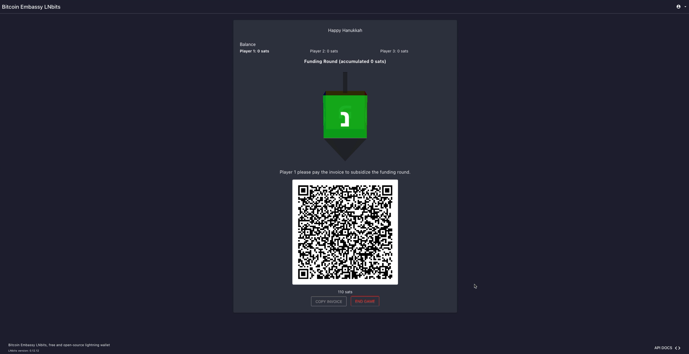

# Dreidel - <small>[LNbits](https://github.com/lnbits/lnbits) extension</small>

<small>For more about LNBits extension check [this tutorial](https://github.com/lnbits/lnbits/wiki/LNbits-Extensions)</small>

We recommend using this extension on LNBits v0.12.12.

## Watch the demo

## Game rules

- The game begins with every player has 0 on their balance, and an empty jackpot.
A funding round is done by each player paying the bet amount to the jackpot.
- Each player needs to spin the dreidel on their turn.
This is done by paying another invoice of the dreidel-spinning price that goes to the service provider
(default 1 sat).
- Possible dreidel results are:
  - Nisht Arayn - נישט: The player wins nothing.
  - Gantz - גאַנץ: The player wins the entire jackpot.
  - Halb - האַלב: The player wins half of the jackpot. If the jackpot amount is odd, the reward is rounded
  in favor of the player (millisats are not supported).
  - Shtel Arayn - שטעל אַרַײן: The player has to pay again. The amount will be deducted automatically
  if the player has enough on their balance, otherwise an invoice will be created for the player to pay.
- When the jackpot gets empty, we have another funding round.
If a player has enough on their balance, the bet amount will be deducted automatically.
Otherwise an invoice will be created for the player to pay.
- Whenever the players decide to end the game, the amount left in the jackpot will be split between the
players.

## Prize Withdrawal

The prizes are withdrawn via LNURL-withdraw QR codes that will be displayed on the screen.
This requires to run the server behind a TOR ".onion" domain, or a domain with a valid SSL certificate
(https).

The QR codes will be displayed on the screen and could be redeemed by anyone visiting the game URL
(without any authentication). This is a party game for small amounts, not for scenarios where players
might try to steal each other's prizes.
